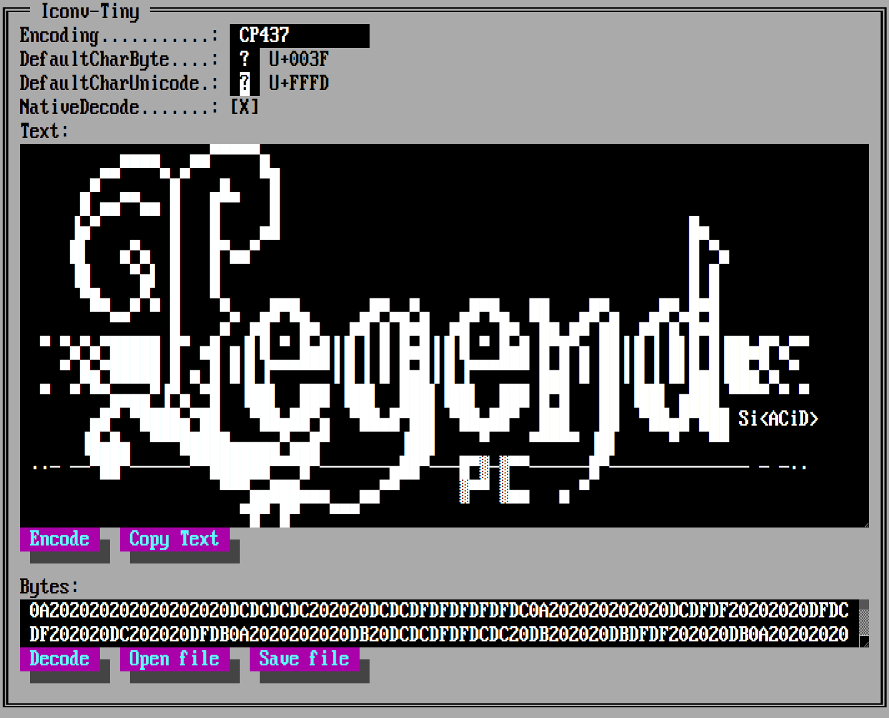

```
╔══──--∙·.      .·∙-──────────────────────══════╗
║ ▪   ▄▄·        ▐  ▄ ▌  ▐·▄▄▄▄▄▄ ▪  ▐  ▄·▄· ▄▌ ║
│ ██ ▐█ ▌▪▪     •█▌▐█▪█·▐▌  •██  ██ •█▌▐█ █▪█▌  ║
│ ▐█·██ ▄▄ ▄█▀▄ ▐█▐▐▌ ▐ █ •▄•▐█.▪▐█·▐█▐▐▌ ▐█▪   │
│ ▐█▌▐█ █▌▐█▌.▐▌█▌▐█▌ ▐█▌    ▐█▌·▐█ █▌▐█▌ ▐█·.  │
│ ▀▀▀·▀▀▀  ▀█▄▀▪▀  █▪. ▀     ▀▀▀ ▀▀ ▀  █▪  ▀ •  │
└──────--∙·    ·∙-───────────────by─ViP-DeLeTe──┘
```

[](https://github.com/vip-delete/iconv-tiny/actions/workflows/ci.yaml)
[](https://github.com/prettier/prettier)
[](https://www.npmjs.com/package/iconv-tiny)

Pure JS character encoding conversion as an ECMAScript Module (ESM). Auto-Generated from http://www.unicode.org/Public/MAPPINGS.

## About

[**iconv-tiny.mjs**](dist/iconv-tiny.mjs) is written from scratch and designed to address all issues and implement all features in the [**iconv-lite**](https://github.com/ashtuchkin/iconv-lite) backlog.
<br/>
It is an ES-module and should work in all modern browsers and NodeJS that supports ESM, `TextDecoder`, and `TextEncoder`.

## Features

1. Zero dependencies.
1. Browser support **out-of-the-box**.
1. Tree shaking and other ESM-related benefits.
1. Table mappings and default characters overrides.
1. Native `TextDecoder` for some encodings.
1. `encodeInto(Uint8Array)` and `byteLength(string)`
1. Typescript friendly.
1. Tiny: 1 file, ~12KB in gzip.

## Installation

```
npm install iconv-tiny
```

or use CDN:

```html
<script type="importmap">
  {
    "imports": {
      "iconv-tiny": "https://unpkg.com/iconv-tiny@1.2.3/dist/iconv-tiny.mjs"
    }
  }
</script>
```

## Basic API

API is very close to **iconv-lite** API, see [iconv-tiny.d.mts](dist/iconv-tiny.d.mts).

```javascript
import { IconvTiny, aliases, encodings, canonicalize } from "iconv-tiny";

// Create iconv
const iconv = new IconvTiny(encodings, aliases);

// Convert from an Uint8Array to a js string.
str = iconv.decode(new Uint8Array([0x68, 0x65, 0x6c, 0x6c, 0x6f]), "win1251");

// Convert from a js string to an Uint8Array.
buf = iconv.encode("Sample input string", "win1251"); // Uint8Array

// Check if encoding is supported
aliases.split(/,| /).map(canonicalize).includes(canonicalize("us-ascii"));
```

or import encodings individually to enable ESM bundlers to remove unused encodings and reduce the final bundle size.

```javascript
import { CP1251 } from "iconv-tiny";

const cp1251 = CP1251.create();
const buf = cp1251.encode("Век живи — век учись.");
const str = cp1251.decode(buf);
```

## Streaming API

```javascript
import { UTF16LE } from "iconv-tiny";

// Create encoding
const utf16 = UTF16LE.create();

// Create decoder, it works like TextDecoder with {stream: true} option.
const decoder = utf16.newDecoder();

// Decode a fragment
const part = decoder.decode(new Uint8Array([0x3d, 0xd8, 0x0a]));

// Decode the next fragment
const str = decoder.decode(new Uint8Array([0xde])); // 😊

// Finish stream decoding
const tail = decoder.decode();
```

See more [examples](examples).

## Supported encodings:

1. **ISO-8859**: 1,2,3,4,5,6,7,8,9,10,11,13,14,15,16
1. **EBCDIC**: Cp037, Cp500, Cp875, Cp1026
1. **DOS**: Cp437, Cp737, Cp775, Cp850, Cp852, Cp855, Cp857, Cp860, Cp861, Cp862, Cp863, Cp864, Cp865, Cp866, Cp869, Cp874
1. **WINDOWS**: Cp1250, Cp1251, Cp1252, Cp1253, Cp1254, Cp1255, Cp1256, Cp1257, Cp1258
1. **MAC**: CYRILLIC, GREEK, ICELAND, LATIN2, ROMAN, TURKISH
1. **MISC**: ATARIST, Cp424, CP856, Cp1006, KOI8-R, KOI8-U, KZ1048, NEXTSTEP
1. **OTHER**: US-ASCII
1. **UNICODE**: UTF-8, UTF-16, UTF-32

All encodings are generated automatically from http://www.unicode.org/Public/MAPPINGS with a few additional mappings for **CP875** (0xE1 -> 0x20AF, 0xEC -> 0x037A, 0xFC -> 0x20AC) and **CP1255** (0xCA -> 0x05BA), see [mappings](scripts/mappings/)

**iconv-tiny** output is identical to **iconv-lite** output, see [tests/regression.test.mjs](tests/regression.test.mjs).

## Encoding/decoding speed

Comparison with iconv-lite module (Core i7-7500U CPU @ 2.7GHz, Node v24.2.0). Note: your results may vary, so please always check on your hardware.

```
operation          iconv-lite@0.7.0   iconv-tiny@1.2.3
------------------------------------------------------
encode('win1251')     ~598 Mb/s          ~622 Mb/s
decode('win1251')     ~218 Mb/s          ~263 Mb/s
```

**iconv-lite** is NodeJS oriented and use specific API like `Buffer` and native NodeJS encodings.
<br/>
**iconv-tiny** is Browser oriented and use `Uint8Array` and native `TextDecoder`, and `TextEncoder`. Also it supports `encodeInto(Uint8Array)` and `byteLength(string)`.

## BOM Handling

1. UTF-8, UTF-16LE, UTF-16BE, UTF-32LE, UTF-32BE:
   - Decoding: BOM is stripped by default, unless overridden by `stripBOM: false` option.
   - Encoding: No BOM added, unless overridden by `addBOM: true` option.
1. UTF-16 is an alias of UTF-16LE
1. UTF-32 is an alias of UTF-32LE

## Testing

```
$ git clone https://github.com/vip-delete/iconv-tiny.git
$ cd iconv-tiny
$ npm test

$ # To view performance:
$ node tests\perf-test-cp1251.mjs
$ node tests\perf-test-unicode.mjs

$ # To view test coverage:
$ npm run coverage

----------------|---------|----------|---------|---------|-------------------
File            | % Stmts | % Branch | % Funcs | % Lines | Uncovered Line #s
----------------|---------|----------|---------|---------|-------------------
All files       |     100 |      100 |   96.72 |     100 |
 commons.mjs    |     100 |      100 |   81.81 |     100 |
 iconv-tiny.mjs |     100 |      100 |     100 |     100 |
 sbcs.mjs       |     100 |      100 |     100 |     100 |
 unicode.mjs    |     100 |      100 |     100 |     100 |
----------------|---------|----------|---------|---------|-------------------
```

## Commands

Build:

```
npm run build
```

UI Demo:

```
npm run dev
```

Compile (optional, you need JDK 21 or higher installed):

```
npm run compile
```

## Demo

https://vip-delete.github.io/iconv-tiny/


